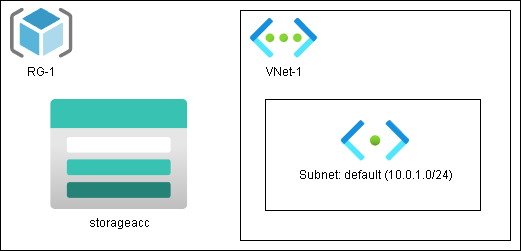

# deploy-basic-azure-infrastructure

This project demonstrates how to deploy foundational Azure infrastructure using **ARM templates** and **Azure CLI**. The deployment includes:

- A **Resource Group**
- A **Storage Account**
- A **Virtual Network (VNet)** with one Subnet

---

##  Learning Objectives

- Create and manage Azure Resource Groups using the CLI
- Deploy services using Infrastructure as Code (ARM templates)
- Understand dependencies between Azure resources
- Visualize a basic Azure infrastructure architecture

---

##  Tools & Technologies

- [Azure CLI](https://learn.microsoft.com/en-us/cli/azure/)
- [ARM Templates](https://learn.microsoft.com/en-us/azure/azure-resource-manager/templates/overview)
- Azure Portal (for validation)

---

##  Architecture Diagram

