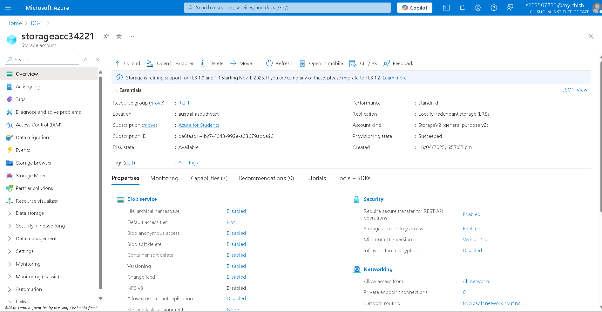
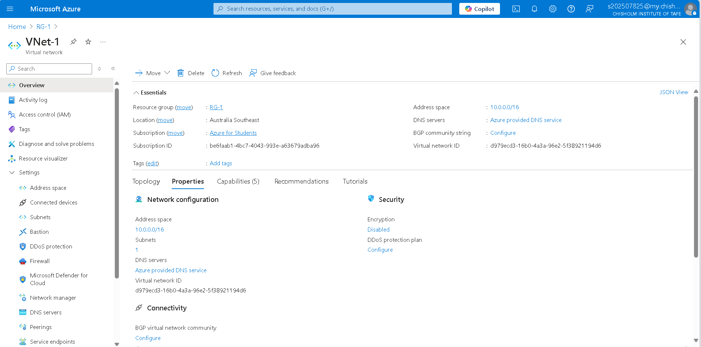

# deploy-basic-azure-infrastructure

This project demonstrates how to deploy foundational Azure infrastructure using **ARM templates** and **Azure CLI**. The deployment includes:

- A **Resource Group**
- A **Storage Account**
- A **Virtual Network (VNet)** with one Subnet


---

##  Learning Objectives

- Create and manage Azure Resource Groups using the CLI
- Deploy services using Infrastructure as Code (ARM templates)
- Understand dependencies between Azure resources
- Visualize a basic Azure infrastructure architecture

---

##  Tools & Technologies

- [Azure CLI](https://learn.microsoft.com/en-us/cli/azure/)
- [ARM Templates](https://learn.microsoft.com/en-us/azure/azure-resource-manager/templates/overview)
- Azure Portal (for validation)

---

### 🔹 Step 1: Create a Resource Group (`RG-1`)

**What I did:**

- Used Azure CLI to create a Resource Group named `RG-1` in the `australiasoutheast` region.
- This group serves as the container for all the resources deployed in this project.

**Command:**
```bash
az group create --name RG-1 --location australiasoutheast
```
.png)
.png)

### 🔹 Step 2: Write an ARM Template (`arm-template.json`)

**What I did:**

- Created an Azure Resource Manager (ARM) template in JSON format.
- The template defines:
  - A **Storage Account** with a globally unique name.
  - A **Virtual Network** named `VNet-1` with one subnet.
- Saved the template locally as `arm-template.json`.

**ARM Template Example:**
```json
{
  "$schema": "https://schema.management.azure.com/schemas/2019-04-01/deploymentTemplate.json#",
  "contentVersion": "1.0.0.0",
  "resources": [
    {
      "type": "Microsoft.Storage/storageAccounts",
      "apiVersion": "2019-06-01",
      "location": "australiasoutheast",
      "properties": {
        "sku": {
          "name": "Standard_LRS"
        },
        "kind": "StorageV2",
        "accessTier": "Hot"
      },
      "name": "storageacc"
    },
    {
      "type": "Microsoft.Network/virtualNetworks",
      "apiVersion": "2019-09-01",
      "location": "australiasoutheast",
      "properties": {
        "addressSpace": {
          "addressPrefixes": [
            "10.0.0.0/16"
          ]
        },
        "subnets": [
          {
            "name": "Subnet-1",
            "properties": {
              "addressPrefix": "10.0.1.0/24"
            }
          }
        ]
      },
      "name": "VNet-1"
    }
  ]
}
```
### 🔹 Step 3: Deploy Resources Using the ARM Template

**What I did:**

- Deployed the ARM template using the Azure CLI to create the resources (Storage Account and Virtual Network) defined in the `arm-template.json`.
- Ran the following `az deployment group create` command to deploy the resources in the `RG-1` Resource Group.

**Command:**
```bash
az deployment group create --resource-group RG-1 --template-file ./arm-template.json
```
.png)
.png)

### 🔹 Step 4: Verify Resources in Azure Portal

**What I did:**

- After deploying the resources, I verified that the **Storage Account** and **Virtual Network** were successfully created.
- I navigated to the **Azure Portal** and checked the **RG-1** Resource Group to confirm the presence of the following resources:
  - **Storage Account** named `storageacc`
  - **Virtual Network** named `VNet-1`

**How to Verify:**
1. Go to [Azure Portal](https://portal.azure.com/).
2. In the left-hand menu, click on **Resource groups**.
3. Select the **RG-1** Resource Group.
4. Verify that the **Storage Account** and **Virtual Network** appear in the list of resources. 



---

##  Architecture Diagram


##  ARM Template
You can find the ARM template for deploying the resources in this project [here](./arm-template.json).
