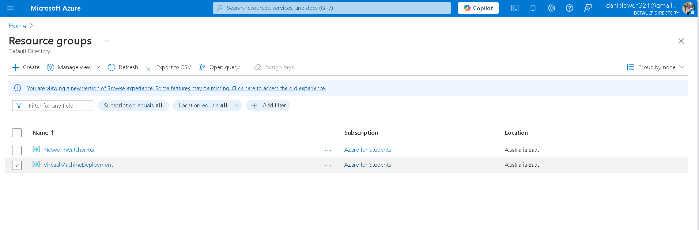
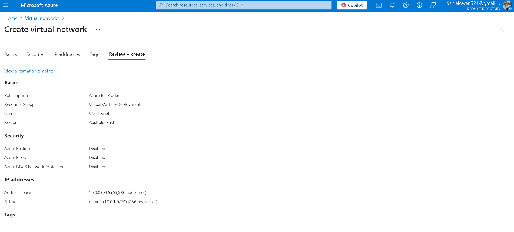
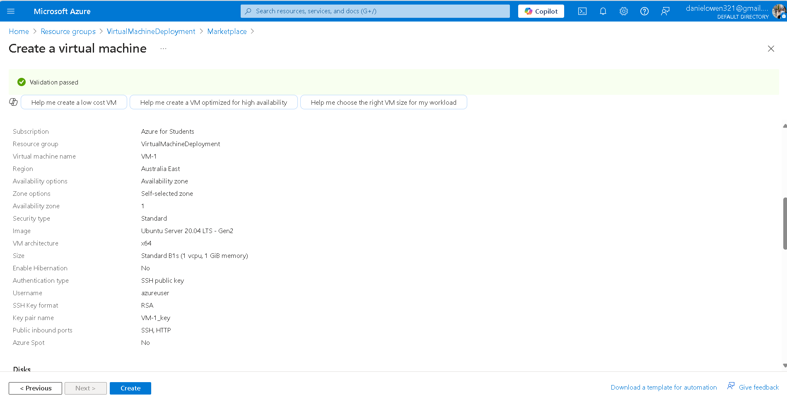
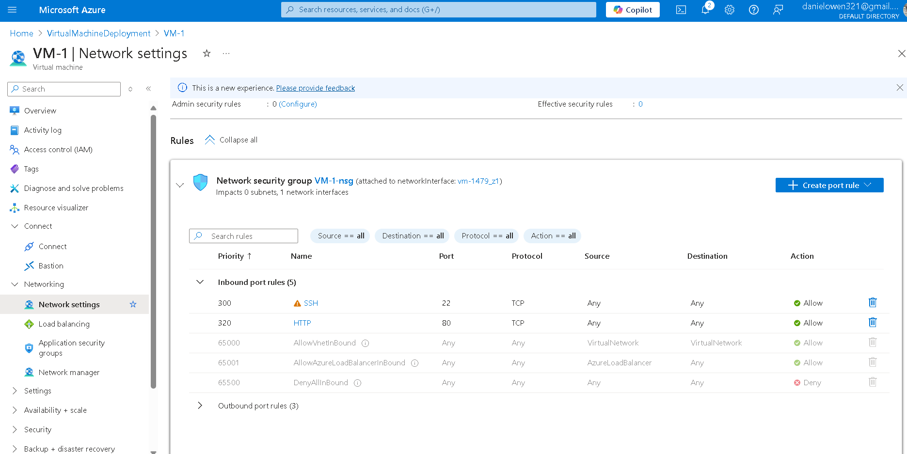
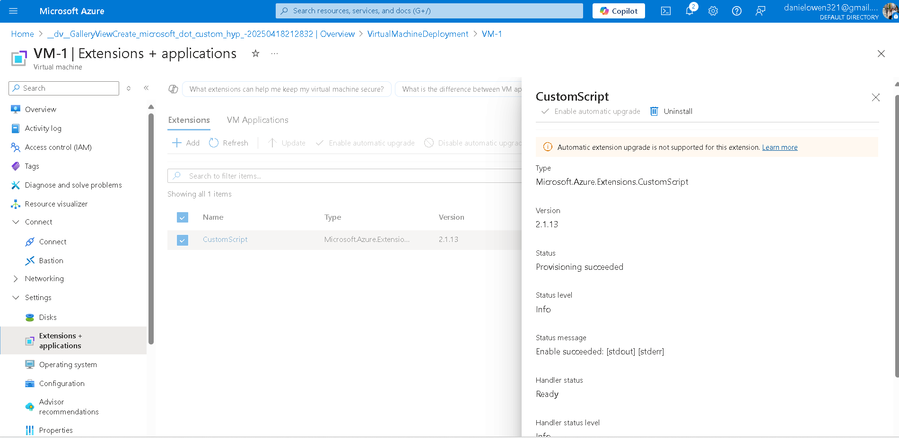
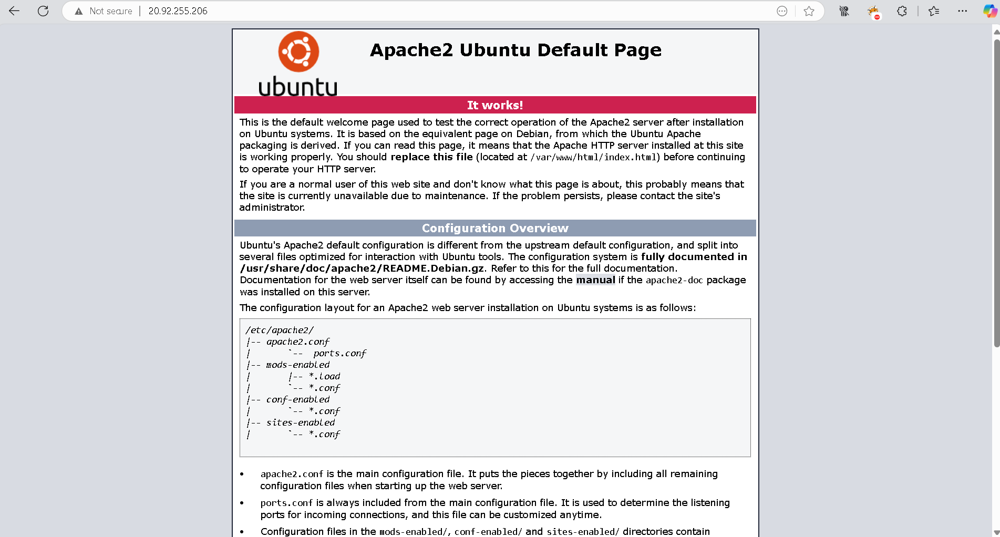

# deploy-azure-vm

This project demonstrates how to deploy and configure a basic Azure Virtual Machine (VM) in a **Resource Group** using the **Azure Portal**, with steps for SSH key management, networking, and custom script configuration.

---

## Learning Objectives

- Create and manage Azure Virtual Machines using the Azure Portal
- Configure SSH key-based authentication for secure VM access
- Set up a Virtual Network (VNet) and Subnet for networking
- Automate configuration using custom scripts during VM creation
- Understand VM management and monitoring tools in Azure

---

## Tools & Technologies

- [Azure Portal](https://portal.azure.com/)
- [Azure CLI](https://learn.microsoft.com/en-us/cli/azure/)
- SSH (for connecting to VM)
- Custom scripts for automation and configuration

---

### 🔹 **Step 1: Create a Resource Group**

- **Name:** `VirtualMachineDeployment`  
- **Region:** `Australia East`  

**Instructions:**
1. In the [Azure Portal](https://portal.azure.com/), navigate to **Resource Groups**.
2. Click **+ Add**.
3. Set the **Resource Group Name** to `VirtualMachineDeployment`.
4. Choose **Region** as `Australia East`.
5. Click **Review + Create**, then **Create**.


---

### 🔹 **Step 2: Create a Virtual Network (VNet)**

- **Name:** `VM_VNet`  
- **Address space:** `10.0.0.0/16`  
- **Subnet:** `10.0.1.0/24`  
- **Region:** `Australia East`

**Instructions:**
1. In the [Azure Portal](https://portal.azure.com/), go to **Create a resource**.
2. In the search box, type **Virtual Network** and select **Virtual Network**.
3. Click **Create**.
4. Fill in the following details:
   - **Subscription:** Choose your subscription.
   - **Resource Group:** Select `VirtualMachineDeployment` (the one you created in Step 1).
   - **Name:** `VM-1-vnet`
   - **Region:** `Australia East`
   - **Address space:** `10.0.0.0/16`
   - **Subnet:** Click **+ Add subnet** and enter `10.0.1.0/24` as the subnet address range.
5. Click **Review + Create**, then **Create**.


---

### 🔹 **Step 3: Create a Virtual Machine (VM)**

- **Name:** `VM-1`  
- **Image:** Ubuntu 20.04 LTS  
- **Size:** B1s  
- **Authentication:** SSH public key  
- **VNet/Subnet:** `VM-1-vnet`  
- **Region:** `East`

**Instructions:**
1. In the [Azure Portal](https://portal.azure.com/), go to **Create a resource**.
2. In the search box, type **Virtual Machine** and select **Virtual Machine**.
3. Click **Create**.
4. Fill in the following details:
   - **Subscription:** Choose your subscription.
   - **Resource Group:** Select `VirtualMachineDeployment` (the one you created in Step 1).
   - **VM Name:** `VM-1`
   - **Region:** `Australia East`
   - **Image:** Select **Ubuntu 20.04 LTS**
   - **Size:** Choose **B1s** (small instance for testing purposes).
   - **Authentication Type:** Select **SSH public key**.
   - **Public Key:** Paste your **SSH public key** (generated using `ssh-keygen`).
5. Under **Networking**, choose:
   - **Virtual Network:** Select `VM-1-vnet`.
   - **Subnet:** Choose the `default` subnet you created earlier (`10.0.1.0/24`).
6. Click **Review + Create**, then **Create**.


---

### 🔹 **Step 4: Configure NSG Rules for Inbound Access**
What I did:

Added a **Network Security Group (NSG)** inbound rule to allow **HTTP (port 80)** traffic so the Apache web server is accessible publicly.

**Configuration:**

**Port: 80 (HTTP)**

**Protocol: TCP**

**Priority: 320**

**Action: Allow**

Action:

**Go to VM-1 in the Azure Portal.**

**Navigate to Networking → Inbound port rules.**

**Click + Add inbound port rule.**

**Enter the configuration above.**

**Click Add to save the rule.**


---

### 🔹 **Step 5: Install Apache2 Using a Custom Script (Post-Deployment)**

What I did:
- Initially, I tried to automate the installation of Apache2 by using the **Extensions + Applications** feature in the Azure Portal to run a custom **Bash script** during the VM's post-deployment process. The script was intended to update the package list, install Apache2, and start the service.

Script I used:

```bash
#!/bin/bash
apt update
apt install apache2 -y
systemctl start apache2
```
However, the script extension did not work as expected, and the Apache2 service was not installed automatically.

As a result, I accessed the VM via SSH and manually installed the Apache2 web server by running the following commands:

```bash
Copy
Edit
sudo apt update              # Update package lists
sudo apt install apache2 -y   # Install Apache2
sudo systemctl start apache2  # Start Apache service
sudo systemctl enable apache2 # Enable Apache to start on boot
```
After running these commands, Apache2 was successfully installed and started.
Accessing Apache:
After Apache was installed and started, I accessed the default Apache page by navigating to the public IP of the VM (http://20.92.255.206) in a web browser.

The Apache default page ("It works!") was displayed, confirming that Apache was correctly serving content.



